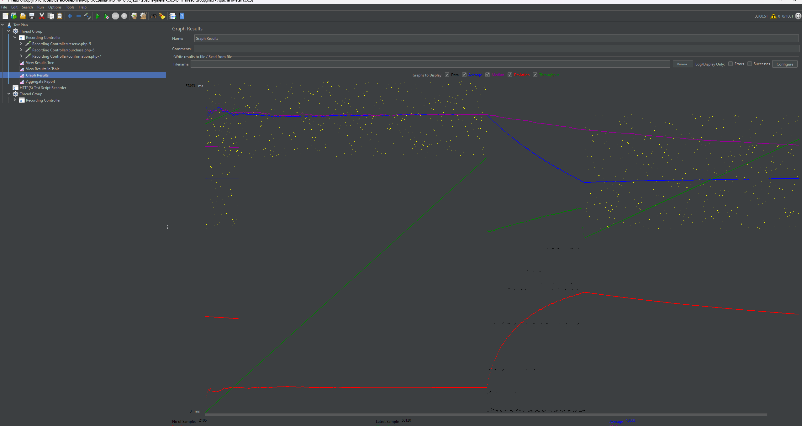
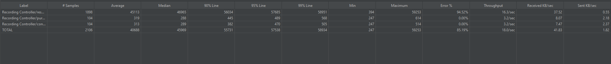
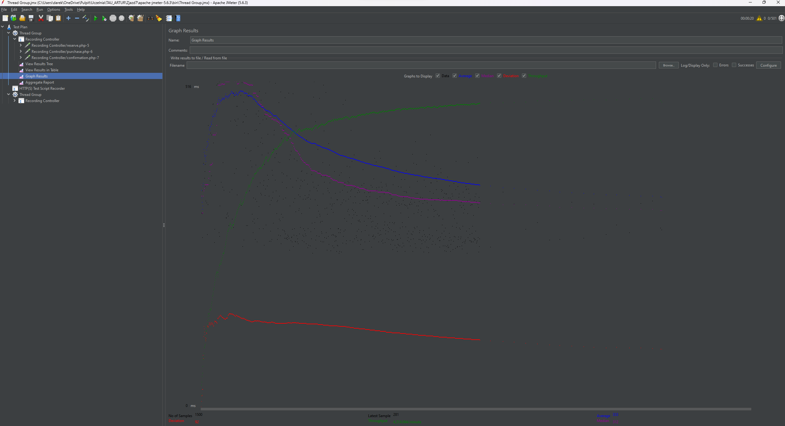
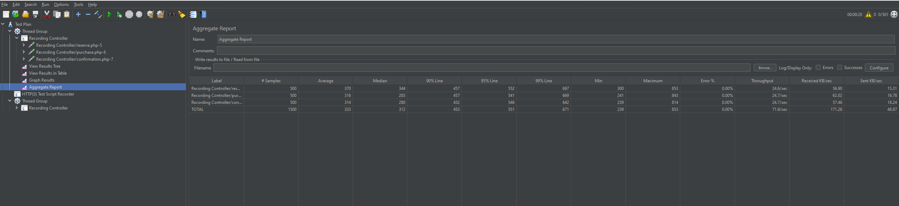

Na podstawie dostarczonych danych wynikowych dla dwóch różnych scenariuszy, można wyciągnąć pewne wnioski dotyczące wydajności aplikacji.

    Poprawne działanie aplikacji dla 500 osób na 20 sekund:
        Średni czas odpowiedzi wynosi 333 ms, co jest na akceptowalnym poziomie.
        Mediana wynosi 312 ms, co sugeruje, że większość użytkowników doświadcza krótkich czasów odpowiedzi.
        Throughput wynosi 71.9 transakcji na sekundę, co jest również dobre.
        Błąd procentowy wynosi 0%, co oznacza brak błędów w przetwarzaniu żądań.

    Anomalia dla 1000 osób na 20 sekund:
        Średni czas odpowiedzi znacząco wzrasta do 40688 ms, co wskazuje na poważne spowolnienie działania aplikacji.
        Mediana osiąga wartość 45969 ms, co dodatkowo potwierdza, że większość użytkowników doświadcza długich czasów odpowiedzi.
        Throughput spada do 18.0 transakcji na sekundę, co jest znacznie niższe niż w poprzednim przypadku.
        Pojawił się błąd procentowy na poziomie 85.19%, co sugeruje, że aplikacja nie radzi sobie z obsługą większej ilości użytkowników i generuje błędy dla 	85.19% żądań.

    Przestanie odpowiadać:
        Aplikacja przestaje odpowiadać w przypadku scenariusza z 1000 użytkownikami, co jest zauważalne z bardzo długiego czasu odpowiedzi i wysokiego 	odsetka błędów.
        Przeskok od braku błędów w przypadku 500 użytkowników do 85.19% błędów w przypadku 1000 użytkowników jest znaczący i wskazuje na przekroczenie 	zdolności przetwarzania aplikacji.

Wniosek: Aplikacja działa poprawnie i efektywnie obsługuje 500 użytkowników, ale zaczyna doświadczać poważnych problemów wydajnościowych przy próbie obsługi 1000 użytkowników na 20 sekund. W tym przypadku, czas odpowiedzi znacznie rośnie, a throughput spada, co prowadzi do dużej liczby błędów i w ostateczności do zatrzymania działania aplikacji dla części użytkowników. Konieczne jest zoptymalizowanie aplikacji lub zwiększenie jej zdolności przetwarzania, aby utrzymać poprawne działanie nawet przy większym obciążeniu.

